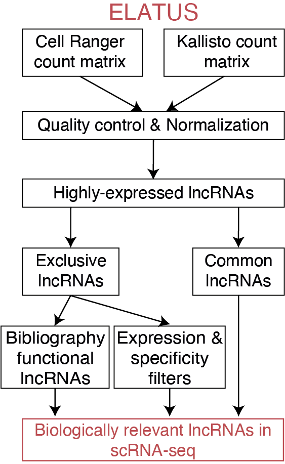

# ELATUS: Elucidating biologically relevant lncRNA annotated transcripts using scRNA-seq

This workflow is designed to, through droplet-based scRNA-seq, not only retain highly-expressed lncRNAs robustly detected by Cell Ranger and Kallisto, but also uncover functionally relevant lncRNAs that are only detected by Kallisto. 
<p align="center">

</p>

# System Requirements
## Hardware requirements
`ELATUS` package requires only a standard computer with enough RAM to support the in-memory operations.

## Software requirements
### OS Requirements
`ELATUS` is supported for *macOS* and *Linux*. The package has been tested on the following systems:
+ macOS: Catalina (10.15.7)
+ Linux: Ubuntu 20.04.4 LTS, CentOS 7.15.1804

### R dependencies
`ELATUS` has been tested in R version 4.1.0 and 4.1.12.
Seurat and some bioconductor packages will be required that will not be automatically installed. Therefore, they will have to be manually installed:
```{r}
install.packages("Seurat")
BiocManager::install("scran")
BiocManager::install("BUSpaRse")
BiocManager::install("DropletUtils")
BiocManager::install("scDblFinder")
```

# Installation
Installation is performed with devtools. 
Installing all the different dependencies takes around 15 minutes in a personal laptop. However, the most rece versions of Seurat and Matrix packages can produce inconsistencies and result in [compilation errors](https://github.com/satijalab/seurat/issues/7581). This is easilisy solved by removing Matrix and installing a previous release:
```{r}
remove.packages("Matrix")
install.packages("https://cran.r-project.org/src/contrib/Archive/Matrix/Matrix_1.5-1.tar.gz")
```
Now you can install ELATUS with:
```{r}
install.packages("devtools")
devtools::install_github("kikegoni/ELATUS")
```
Once all the dependencies are installed, the installation of ELATUS takes 2-3 minutes in a desktop computer. If you are having an issue that you believe to be tied to software versioning issues, please drop us an [Issue](https://github.com/kikegoni/ELATUS/issues). 

# Input files
ELATUS needs the raw unfiltered count matrix from Cell Ranger and Kallisto as input. In particular, Cell Ranger count generates a barcodes.tsv.gz file, a features.tsv.gz file and a matrix.mtx.gz file, while Kallisto-Bustools generates a barcodes.txt file, a genes.txt file and an .mtx file. Some guidelines to preprocess fastq files with Cell Ranger and Kallisto are included [here](https://github.com/kikegoni/ELATUS/blob/main/demo_CellRanger_Kallisto.sh). Also, ELATUS can be applied with the filtered count data using [ELATUS_filtered function](https://github.com/kikegoni/ELATUS/blob/main/R/ELATUS_filtered.r). ELATUS uses [public CRISPRi data from 7 human cell lines](https://www.science.org/doi/10.1126/science.aah7111?url_ver=Z39.88-2003&rfr_id=ori:rid:crossref.org&rfr_dat=cr_pub%20%200pubmed) to investigate exclusive lncRNAs whose function has been bibliographically validated. This bibliographic collection will be further expanded in the future. 

# Demo
For this particular example the mouse brain dataset consisting on 1000 cells that was analyzed in the paper is used ("Mm_brain_1k"). In this example, ELATUS uses as input the raw scRNA-seq count matrices generated by Kallisto and Cell Ranger. Next, it removes empty droplets and filters low-quality cells. After a normalization step, it clusters the cells and identifies highly-expressed lncRNAs. It retains not only highly-expressed lncRNAs robustly detected by Cell Ranger and Kallisto, but also lncRNAs that are only detected by Kallisto and whose functionality has been independently validated or that exhibit characteristics of functional lncRNAs. 
A vignette with a step-by-step of the ELATUS processing is included [here](https://github.com/kikegoni/ELATUS/blob/main/inst/extdata/ELATUS_vignette.md)
```{r}
library("ELATUS")
functional_lncRNAs <- ELATUS(kallisto_path=system.file("extdata", "kallisto_example_raw_matrix", package = "ELATUS"), kallisto_name="cells_genes_NO_multimapping", cellRanger_path=system.file("extdata", "cellRanger_example_raw_matrix", package = "ELATUS"), organism = "Mouse", lower_emptydrops = 1000, EmptyDrops_FDR_thres = 0.01, cells_mito_threshold= 15, cells_max_threshold = 30000, cells_min_genes_detected_threshold = 500, threshold_minumun_gene_counts = 250, threshold_cells_detected = 25, dimred_clustering = "PCA", k_neighbors = 5, ratio_threshold = 40, CR_threshold = 10, SI_threshold = 0.15)
```

## Functions

For interactive demos of the functions, please check out the vignettes built into the package. They can be accessed as follows:

```
require(ELATUS)
?ELATUS
?Filtering
?SI
?biologically_relevant_lncRNAs
?crispr_info
?emptydrops_filt
?get_candidates
?import_CellRanger_sc
?import_kallisto_sc
?qc_metrics
?remove_doublets
?top_genes
```

# Results
In this investigation, we provide a comprehensive collection of functional lncRNAs in scRNA-seq. This set includes both highly-expressed lncRNAs robustly detected by Cell Ranger and Kallisto, as well as exclusive lncRNAs highly expressed and specific. For this example, it identifies 109 lncRNAs that exhibit characteristics of functional lncRNAs (running time < 10 minutes in a desktop computer).
```{r}
> head(functional_lncRNAs,5)
        candidates       ratio                 gene kallisto_total_expression cellRanger_total_expression         SI cell_type_SI crispr_intersection         category
Gm6209      Gm6209 219.7538052 ENSMUSG00000102715.2                  218.7538                     0.00000 0.23788233            7               FALSE Exclusive_lncRNA
Gm15637    Gm15637  96.4384075 ENSMUSG00000087386.2                  289.7927                     2.01532 0.20469014           15               FALSE Exclusive_lncRNA
Gm19938    Gm19938   0.9987093 ENSMUSG00000102331.2                  623.9760                   624.78372 0.13784393           11                  NA    Common_lncRNA
Snhg6        Snhg6   0.9946959 ENSMUSG00000098234.8                 1168.3728                  1174.60826 0.04570088            7                  NA    Common_lncRNA
Gm16152    Gm16152   1.4073071 ENSMUSG00000087131.8                  378.7060                   268.81030 0.14565333            3                  NA    Common_lncRNA
```

## Session information
```{r}
> sessionInfo()
R version 4.1.2 (2021-11-01)
Platform: x86_64-pc-linux-gnu (64-bit)
Running under: CentOS Linux 7 (Core)

Matrix products: default
BLAS/LAPACK: /beegfs/easybuild/CentOS/7.5.1804/Skylake/software/FlexiBLAS/3.0.4-GCC-11.2.0/lib64/libflexiblas.so.3.0

locale:
 [1] LC_CTYPE=en_US.UTF-8       LC_NUMERIC=C              
 [3] LC_TIME=en_US.UTF-8        LC_COLLATE=en_US.UTF-8    
 [5] LC_MONETARY=en_US.UTF-8    LC_MESSAGES=en_US.UTF-8   
 [7] LC_PAPER=en_US.UTF-8       LC_NAME=C                 
 [9] LC_ADDRESS=C               LC_TELEPHONE=C            
[11] LC_MEASUREMENT=en_US.UTF-8 LC_IDENTIFICATION=C       

attached base packages:
[1] stats     graphics  grDevices utils     datasets  methods   base     

other attached packages:
[1] ELATUS_1.0.0

loaded via a namespace (and not attached):
  [1] utf8_1.2.2                  R.utils_2.12.0             
  [3] reticulate_1.26             tidyselect_1.2.0           
  [5] RSQLite_2.2.18              AnnotationDbi_1.56.2       
  [7] htmlwidgets_1.5.4           grid_4.1.2                 
  [9] BiocParallel_1.28.3         Rtsne_0.16                 
 [11] scDblFinder_1.8.0           DropletUtils_1.14.2        
 [13] ScaledMatrix_1.2.0          munsell_0.5.0              
 [15] codetools_0.2-18            ica_1.0-3                  
 [17] statmod_1.4.37              scran_1.22.1               
 [19] xgboost_1.6.0.1             future_1.28.0              
 [21] miniUI_0.1.1.1              spatstat.random_3.1-3      
 [23] colorspace_2.0-3            progressr_0.11.0           
 [25] Biobase_2.54.0              filelock_1.0.2             
 [27] Seurat_4.0.1                stats4_4.1.2               
 [29] SingleCellExperiment_1.16.0 ROCR_1.0-11                
 [31] tensor_1.5                  listenv_0.8.0              
 [33] MatrixGenerics_1.6.0        BUSpaRse_1.8.0             
 [35] GenomeInfoDbData_1.2.7      polyclip_1.10-0            
 [37] bit64_4.0.5                 rhdf5_2.38.1               
 [39] parallelly_1.32.1           vctrs_0.6.5                
 [41] generics_0.1.3              BiocFileCache_2.2.1        
 [43] R6_2.5.1                    GenomeInfoDb_1.30.1        
 [45] ggbeeswarm_0.6.0            rsvd_1.0.5                 
 [47] locfit_1.5-9.6              AnnotationFilter_1.18.0    
 [49] bitops_1.0-7                rhdf5filters_1.6.0         
 [51] spatstat.utils_3.0-1        cachem_1.0.6               
 [53] DelayedArray_0.20.0         assertthat_0.2.1           
 [55] promises_1.2.0.1            BiocIO_1.4.0               
 [57] scales_1.2.1                beeswarm_0.4.0             
 [59] gtable_0.3.1                beachmat_2.10.0            
 [61] globals_0.16.1              goftest_1.2-3              
 [63] ensembldb_2.18.4            rlang_1.1.1                
 [65] zeallot_0.1.0               splines_4.1.2              
 [67] rtracklayer_1.54.0          lazyeval_0.2.2             
 [69] spatstat.geom_3.0-6         plyranges_1.14.0           
 [71] yaml_2.3.5                  reshape2_1.4.4             
 [73] abind_1.4-5                 GenomicFeatures_1.46.5     
 [75] httpuv_1.6.6                tools_4.1.2                
 [77] ggplot2_3.4.2               ellipsis_0.3.2             
 [79] spatstat.core_2.4-4         RColorBrewer_1.1-3         
 [81] BiocGenerics_0.40.0         ggridges_0.5.4             
 [83] Rcpp_1.0.9                  plyr_1.8.7                 
 [85] sparseMatrixStats_1.6.0     progress_1.2.2             
 [87] zlibbioc_1.40.0             purrr_1.0.2                
 [89] RCurl_1.98-1.9              prettyunits_1.1.1          
 [91] rpart_4.1.16                deldir_1.0-6               
 [93] viridis_0.6.2               pbapply_1.5-0              
 [95] cowplot_1.1.1               S4Vectors_0.32.4           
 [97] zoo_1.8-11                  SeuratObject_4.1.3         
 [99] SummarizedExperiment_1.24.0 ggrepel_0.9.1              
[101] cluster_2.1.4               magrittr_2.0.3             
[103] data.table_1.14.2           scattermore_0.8            
[105] lmtest_0.9-40               RANN_2.6.1                 
[107] ProtGenerics_1.26.0         fitdistrplus_1.1-8         
[109] matrixStats_0.62.0          hms_1.1.2                  
[111] patchwork_1.1.2             mime_0.12                  
[113] xtable_1.8-4                XML_3.99-0.11              
[115] IRanges_2.28.0              gridExtra_2.3              
[117] scater_1.22.0               compiler_4.1.2             
[119] biomaRt_2.50.3              tibble_3.1.8               
[121] KernSmooth_2.23-20          crayon_1.5.2               
[123] R.oo_1.25.0                 htmltools_0.5.3            
[125] mgcv_1.8-40                 later_1.3.0                
[127] tidyr_1.2.1                 DBI_1.1.3                  
[129] dbplyr_2.2.1                MASS_7.3-58.1              
[131] rappdirs_0.3.3              Matrix_1.5-1               
[133] cli_3.6.2                   R.methodsS3_1.8.2          
[135] metapod_1.2.0               parallel_4.1.2             
[137] igraph_1.3.5                GenomicRanges_1.46.1       
[139] pkgconfig_2.0.3             GenomicAlignments_1.30.0   
[141] sp_1.5-0                    plotly_4.10.0              
[143] scuttle_1.4.0               spatstat.sparse_3.0-0      
[145] xml2_1.3.3                  vipor_0.4.5                
[147] dqrng_0.3.0                 XVector_0.34.0             
[149] stringr_1.4.1               digest_0.6.29              
[151] sctransform_0.3.5           RcppAnnoy_0.0.20           
[153] spatstat.data_3.0-0         Biostrings_2.62.0          
[155] leiden_0.4.3                edgeR_3.36.0               
[157] uwot_0.1.14                 DelayedMatrixStats_1.16.0  
[159] restfulr_0.0.15             curl_4.3.3                 
[161] shiny_1.7.2                 Rsamtools_2.10.0           
[163] rjson_0.2.21                lifecycle_1.0.3            
[165] nlme_3.1-160                jsonlite_1.8.2             
[167] Rhdf5lib_1.16.0             BiocNeighbors_1.12.0       
[169] limma_3.50.3                viridisLite_0.4.1          
[171] BSgenome_1.62.0             fansi_1.0.3                
[173] pillar_1.8.1                lattice_0.20-45            
[175] KEGGREST_1.34.0             fastmap_1.1.0              
[177] httr_1.4.4                  survival_3.4-0             
[179] glue_1.6.2                  png_0.1-7                  
[181] bluster_1.4.0               bit_4.0.4                  
[183] stringi_1.7.8               HDF5Array_1.22.1           
[185] blob_1.2.3                  BiocSingular_1.10.0        
[187] memoise_2.0.1               dplyr_1.0.10               
[189] irlba_2.3.5.1               future.apply_1.9.1         
```

