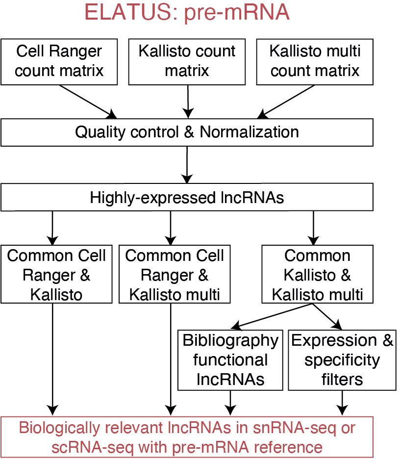

# ELATUS_premRNA: Elucidating biologically relevant lncRNA annotated transcripts using snRNA-seq

This workflow is designed to, through droplet-based snRNA-seq, not only retain highly-expressed lncRNAs robustly detected by Cell Ranger and Kallisto and by Cell Ranger and Kallisto with multimappers, but also uncover functionally relevant lncRNAs that are only detected by Kallisto and Kallisto with multimappers. 
<p align="center">

</p>

# Demo
For this particular example the snRNA-seq dataset consisting on 3000 PBMCs cells that was analyzed in the paper in the multiome analysis is [used](https://www.10xgenomics.com/resources/datasets/pbmc-from-a-healthy-donor-granulocytes-removed-through-cell-sorting-3-k-1-standard-2-0-0). Using an intronic reference, ELATUS:pre_mRNA require the snRNA-seq to be preprocessed with Cell Ranger, Kallisto and Kallisto with multimappers (Kallisto_multi). After quality control and normalization, highly-expresed lncRNAs with each of the three preprocessing options were generated. ELATUS:pre_mRNA, besides retaining robustly expressed lncRNAs detected by both Cell Ranger and Kallisto and by both Cell Ranger and Kallisto_multi, was designed to retain, from the lncRNAs commonly detected by Kallisto and Kallisto_multi, those that were highly specific according to restrictive selection thresholds. Some guidelines to preprocess fastq files with Cell Ranger and Kallisto and Kallisto with multimappers are included [here](https://github.com/kikegoni/ELATUS/blob/main/inst/extdata/demo_CellRanger_Kallisto_premRNA.sh).
```{r}
library("ELATUS")
functional_lncRNAs <- ELATUS::ELATUS_premRNA(kallisto_path="/home/egonie/kike/phd/test_data/10X/MULTIOME_PBMCS_3K/01.Kallisto/output_bus_transcriptome_introns/bustools_results_no_multimappers", kallisto_name="cells_genes_NO_multimapping", cellRanger_path="/home/egonie/kike/phd/test_data/10X/MULTIOME_PBMCS_3K/01.CellRanger/pbmc_granulocyte_sorted_3k_alldata_cellRanger_modified_GEX_test2/outs/raw_feature_bc_matrix",kallisto_multimappers_path = "/home/egonie/kike/phd/test_data/10X/MULTIOME_PBMCS_3K/01.Kallisto/output_bus_transcriptome_introns/bustools_multimappers",kallisto_multimappers_name = "cells_genes_multimapping",  organism = "Human", lower_emptydrops = 1000, EmptyDrops_FDR_thres = 0.01, threshold_minumun_gene_counts = 250, threshold_cells_detected = 25, dimred_clustering = "PCA", k_neighbors = 5, ratio_threshold = 20, CR_threshold = 20, SI_threshold = 0.15)```